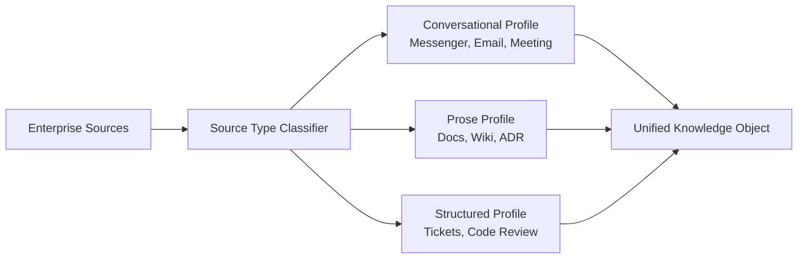
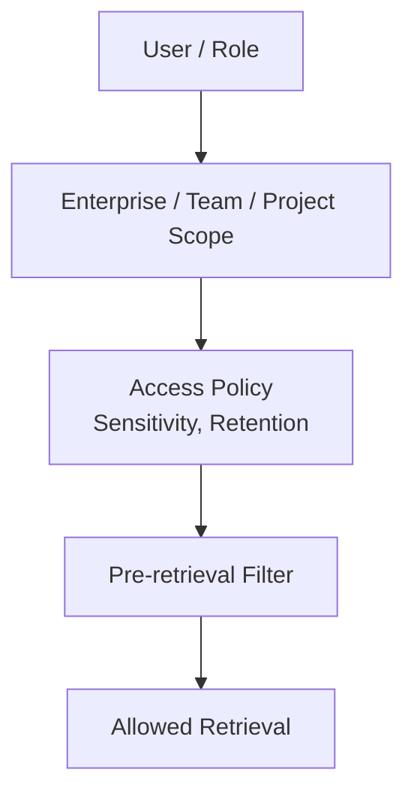
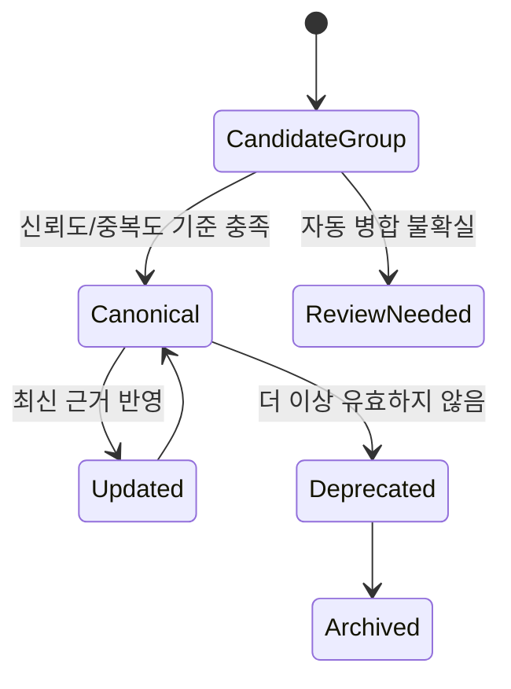
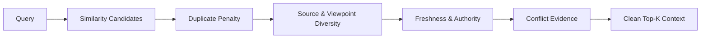
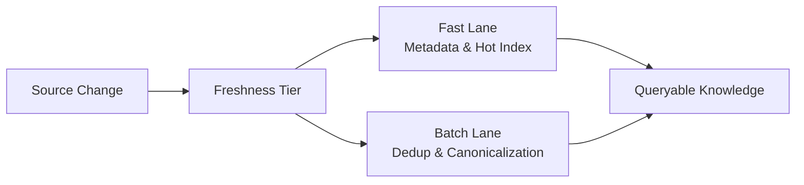

# 중복 지식 제거 기반 Enterprise RAG 프레임워크 Design Point 후보

## 1. 문서 목적

본 문서는 후속 Architecture 설계에서 주요 Design Point가 될 수 있는 항목을 정리한다. 최종 산출물에서는 이 중 4개 정도를 핵심 Design Point로 선택해 상세화하는 것을 전제로 한다. 따라서 여기서는 너무 세부적인 구현 항목을 나열하기보다, 설계 의사결정의 규모가 크고 품질속성에 미치는 영향이 큰 후보 6개로 압축한다.

## 2. 핵심 Design Point 요약

| ID | Design Point | 핵심 질문 | 관련 품질속성 |
| --- | --- | --- | --- |
| DP-1 | Unified Knowledge Model & Source-aware Processing | 서로 다른 형태의 Enterprise 데이터를 하나의 Memory로 다루되, 데이터 유형별 차이를 어떻게 보존할 것인가? | Compatibility, Maintainability, Functional Suitability |
| DP-2 | Knowledge Scope, Security & Governance | 전사/팀/프로젝트 지식과 권한, 민감도, 보존 정책을 어떻게 Retrieval 전에 강제할 것인가? | Security, Integrity, Accountability |
| DP-3 | Deduplication & Canonical Knowledge Lifecycle | 중복 지식을 어떻게 대표화하고, 원본 추적성과 최신성을 유지할 것인가? | Functional Correctness, Resource Utilization, Maintainability |
| DP-4 | Diversity-aware Retrieval & Conflict Resolution | 유사도 중심 검색을 넘어 다양성, 신뢰도, 최신성, 충돌 근거를 어떻게 균형 있게 선택할 것인가? | Functional Appropriateness, Accuracy, Explainability |
| DP-5 | Freshness-aware Pipeline Architecture | 무거운 중복 제거 전처리와 최신 정보 반영 요구를 어떻게 동시에 만족할 것인가? | Time Behaviour, Reliability, Recoverability |
| DP-6 | Observability, Evaluation & Replaceability | 중복 제거 기반 RAG의 품질을 어떻게 측정하고, 빠르게 바뀌는 AI Stack을 어떻게 교체 가능하게 유지할 것인가? | Analysability, Testability, Portability |

## 3. DP-1 Unified Knowledge Model & Source-aware Processing

Enterprise 데이터는 원본별 구조가 크게 다르다. Messenger, Email, Meeting 기록은 발화자, 시간, Thread, 맥락 전환이 중요하다. Wiki, Docs, ADR은 제목, 섹션, 문서 버전, 승인 상태가 중요하다. Tickets와 Code Review는 상태, 담당자, 우선순위, 변경 파일, Merge 여부처럼 구조화된 속성이 중요하다.

따라서 모든 원본 데이터를 동일한 방식으로 Chunking하고 Retrieval하는 것은 위험하다. 설계에서는 공통 `Knowledge Object` 모델을 두되, 데이터 유형별 Processing Profile을 분리해야 한다.

주요 고려사항:

- 공통 Knowledge Object는 출처, URL, 작성자, 작성 시각, 프로젝트, 팀, 권한, 보존 정책을 포함해야 한다.
- 데이터 유형별 고유 메타데이터를 확장 가능하게 보관해야 한다.
- 대화형, 산문형, 구조형 데이터는 Chunking 기준과 중복 판단 기준이 달라야 한다.
- Retrieval 단계에서도 Source Type Diversity를 고려해야 한다.

설계 영향:

- Data Connector 계층과 Normalization 계층이 분리되어야 한다.
- Chunking/Metadata Extractor는 데이터 유형별 전략 객체 또는 Profile로 구성하는 것이 적합하다.
- 후속 설계에서 Knowledge Object Schema가 핵심 산출물이 된다.

## 4. DP-2 Knowledge Scope, Security & Governance

Enterprise RAG는 민감한 조직 지식을 다룬다. Email, Meeting 기록, Code Review, Ticket에는 권한과 보존 정책이 강하게 적용되어야 한다. Retrieval 이후에 필터링하는 방식은 위험하며, 권한과 데이터 분류는 Retrieval 전에 강제되어야 한다.

초기 범위에서는 개인 단위 Memory보다 전사 공통, 팀, 프로젝트 단위 Knowledge Scope를 우선 모델링하는 것이 현실적이다.

주요 고려사항:

- 전사 공통 지식과 프로젝트 지식이 충돌할 수 있다.
- 팀/프로젝트 이동 시 접근 권한과 검색 가능 Scope가 바뀐다.
- 민감정보는 마스킹 또는 검색 제외 정책이 필요하다.
- 보존 기간 만료, 삭제, 권한 변경은 중복 정제보다 우선 반영되어야 한다.
- 답변 생성에 사용된 사용자, 질의, 권한 정책, 근거 출처는 감사 가능해야 한다.

설계 영향:

- Retrieval Query 생성 전에 Scope Resolver와 Policy Engine이 필요하다.
- Knowledge Object에는 보안/민감도/보존 정책 메타데이터가 필수다.
- 감사 로그와 Source Trace는 보안 요구사항의 일부로 설계되어야 한다.

## 5. DP-3 Deduplication & Canonical Knowledge Lifecycle

본 과제의 중심 Design Point이다. 중복 제거는 같은 텍스트를 삭제하는 문제가 아니라, 여러 시스템에 반복 저장된 의미적으로 유사한 지식을 추적성과 최신성을 유지한 채 대표 지식으로 재구성하는 문제다.

중복 유형은 다양하다.

| 유형 | 예시 | 처리 방향 |
| --- | --- | --- |
| Exact Duplicate | 동일 문서 복사본 | 해시 기반 탐지 가능 |
| Near Duplicate | 유사한 Wiki 가이드 여러 개 | 의미 유사도 기반 그룹화 |
| Version Duplicate | 과거 정책 문서와 최신 정책 문서 | 최신성/상태 기반 대표화 |
| Contextual Duplicate | 같은 결정이 Meeting, Ticket, Wiki에 반복 | 출처 연결과 Canonical Knowledge 구성 |

주요 고려사항:

- Canonical Knowledge는 원본 출처 추적성을 잃으면 안 된다.
- 불확실한 중복은 자동 병합하지 않고 Candidate Group으로 남겨야 한다.
- 공식 문서와 비공식 대화가 유사할 때 대표 지식과 보조 맥락을 구분해야 한다.
- 최신성, 승인 상태, 사용 빈도, 출처 신뢰도가 갱신 조건이 될 수 있다.
- Human-in-the-loop 검토가 필요한 지점을 정의해야 한다.

설계 영향:

- Canonical Knowledge Store와 Source Trace Graph가 필요하다.
- Duplicate Detection 결과는 단순 Boolean이 아니라 그룹, 대표성, 신뢰도, 검토 필요 상태를 포함해야 한다.
- 중복 제거는 Retrieval 비용 절감뿐 아니라 답변 품질과 조직 기억 재사용성에 직접 영향을 준다.

## 6. DP-4 Diversity-aware Retrieval & Conflict Resolution

단순 Similarity Ranking은 같은 문서군이나 같은 표현을 반복 검색할 위험이 있다. 중복이 많은 Enterprise 환경에서는 Top-K가 유사한 K개 문서가 아니라, 답변에 필요한 서로 다른 근거 묶음이 되어야 한다.

또한 Enterprise 지식은 출처별 신뢰도가 다르다. 공식 문서가 항상 최신은 아니며, Meeting 기록이나 Ticket이 더 최근 상태를 반영할 수 있다. 따라서 Retrieval은 다양성, 신뢰도, 최신성, 충돌 근거를 함께 고려해야 한다.

주요 고려사항:

- Query relevance
- Duplicate penalty
- Source diversity
- Freshness
- Authority score
- Project/Team Scope match
- Conflict evidence inclusion

충돌 판단 기준:

- Source Type: Wiki, Ticket, Meeting, Email, Code Review 등
- Status: Draft, Approved, Deprecated, Closed, Merged 등
- Recency: 작성일, 수정일, 종료일, Merge 시각
- Ownership: 담당 팀, 승인자, 문서 소유자
- Evidence Link: 결정과 실행 결과의 연결성

설계 영향:

- Similarity Search 이후 Re-ranking 단계가 핵심 컴포넌트가 된다.
- Retrieval 결과는 관련도 점수뿐 아니라 다양성, 중복도, 최신성, 신뢰도 설명을 포함해야 한다.
- 답변 생성 Prompt는 충돌 근거를 숨기지 않고 판단 기준과 함께 설명할 수 있어야 한다.

## 7. DP-5 Freshness-aware Pipeline Architecture

중복 탐지와 Canonicalization은 무거운 전처리 작업이다. 모든 변경을 실시간으로 완전 정제하는 것은 비용과 Latency 측면에서 비현실적일 수 있다. 여기서 Latency는 응답속도만 의미하지 않는다. 원본 시스템에 새로운 정보가 생긴 뒤 RAG 검색과 답변에 반영되기까지의 `Knowledge Freshness Latency`도 별도로 관리해야 한다.

즉, 설계는 두 가지 Latency를 함께 다룬다.

- Response Latency: 사용자가 질문한 뒤 답변을 받기까지의 시간
- Knowledge Freshness Latency: 원본 변경 후 RAG 검색 가능 상태까지의 지연

Freshness Tier 예시:

| Tier | 대상 | 설계 방향 |
| --- | --- | --- |
| Critical | 권한 변경, 삭제, 보존 기간 만료 | 중복 처리보다 먼저 검색 제외 또는 권한 반영 |
| Hot | 고우선순위 Ticket, 장애 기록, 긴급 운영 문서 | 예: 10분 내 검색 가능 상태 반영 |
| Warm | 일반 Wiki/Docs 변경, Meeting 기록 | Near-real-time 또는 수 시간 내 정제 |
| Cold | Archive, 낮은 우선순위 Email Thread | Batch 정제 허용 |

주요 고려사항:

- Canonicalization이 완료되지 않은 최신 정보도 임시 Knowledge로 검색 가능하게 할 것인가?
- 최신 정보와 정제된 Canonical Knowledge가 충돌할 때 무엇을 우선할 것인가?
- Freshness SLA 위반을 어떤 지표와 알림으로 운영할 것인가?
- 권한 변경과 삭제는 반드시 중복 정제보다 우선해야 한다.

설계 영향:

- Fast Lane Indexing과 Batch Canonicalization을 분리해야 한다.
- Metadata-first Update 전략이 필요하다.
- 검색 결과에는 Knowledge 기준 시각과 정제 상태를 표시할 수 있어야 한다.

## 8. DP-6 Observability, Evaluation & Replaceability

중복 제거 기반 RAG는 단순 검색 정확도만으로 평가하기 어렵다. 중복률, 다양성, 토큰 절감, 답변 근거 품질, Freshness Latency를 함께 봐야 한다. 또한 AI Stack은 빠르게 변하므로 특정 LLM, Embedding, Vector DB, Re-ranker에 강하게 종속되지 않는 구조가 필요하다.

후보 지표:

| 지표 | 의미 |
| --- | --- |
| Duplicate Ratio | 원본 지식 중 중복/유사 그룹 비율 |
| Canonical Coverage | 질의 응답에 Canonical Knowledge가 사용된 비율 |
| Context Compression Rate | 원본 후보 대비 최종 Context 축소율 |
| Retrieval Diversity Score | Top-K 안의 출처/관점 다양성 |
| Token Savings | 단순 RAG 대비 입력 토큰 절감량 |
| Answer Groundedness | 답변 주장이 근거에 연결되는 정도 |
| Knowledge Freshness Latency | 원본 변경 후 RAG 검색 가능 상태까지의 지연 |
| Response Latency | 사용자 질의 후 답변 반환까지의 지연 |
| Freshness SLA Violation | 데이터 유형별 Freshness 목표를 초과한 비율 |

교체 가능하게 설계할 대상:

- Embedding Model
- Vector DB
- LLM Provider
- Re-ranking Model
- Duplicate Detection Module
- Data Connector

설계 영향:

- Pipeline 단계별 인터페이스와 데이터 계약을 명확히 정의해야 한다.
- Evaluation Harness와 회귀 평가 데이터셋이 필요하다.
- 운영 지표는 단순 장애 모니터링이 아니라 RAG 품질과 비용 효율을 설명해야 한다.

## 9. 최종 Design Point 선정 후보

최종 산출물에서 4개만 선택한다면 우선순위 후보는 다음과 같다.

| 우선순위 | 후보 | 이유 |
| --- | --- | --- |
| 1 | DP-3 Deduplication & Canonical Knowledge Lifecycle | 과제 제목과 가장 직접적으로 연결되는 핵심 설계 포인트다. |
| 2 | DP-4 Diversity-aware Retrieval & Conflict Resolution | 기존 RAG와 차별화되는 Retrieval 품질 개선 지점이다. |
| 3 | DP-5 Freshness-aware Pipeline Architecture | 중복 제거 전처리와 최신성 요구 사이의 구조적 Trade-off를 설명할 수 있다. |
| 4 | DP-1 Unified Knowledge Model & Source-aware Processing | 다양한 Enterprise 데이터 소스를 다루는 프레임워크 성격을 가장 잘 보여준다. |
| 5 | DP-2 Knowledge Scope, Security & Governance | Enterprise 환경에서 빠질 수 없는 보안/권한 설계 포인트다. |
| 6 | DP-6 Observability, Evaluation & Replaceability | 운영성과 확장성을 설명하는 보조 설계 포인트로 적합하다. |
