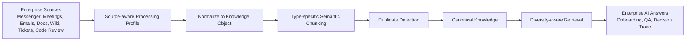

# 중복 지식 제거 기반 Enterprise RAG 프레임워크 Overview

## 1. 문서 목적

본 문서는 `중복 지식 제거 기반 Enterprise RAG 프레임워크` 과제의 Architecture Overview를 정의한다. 대상 시스템은 특정 메신저 서비스에 종속된 AI Assistant가 아니라, 조직 내부에 분산된 다양한 업무 지식을 통합하고 재사용 가능한 Organizational Memory로 구성하는 Enterprise RAG Framework이다.

본 단계의 목적은 상세 설계가 아니라 문제 정의, 비즈니스 배경, 기술적 배경, 이해관계자, 비정제 Use Case, 기능 요구사항, 품질속성, 제약사항을 SW Architect 관점에서 정리하는 것이다. 중복 지식 제거와 지식 증류 기술은 핵심 설계 동인이지만, 이 문서에서는 특정 알고리즘 구현보다 왜 그러한 아키텍처가 필요한지를 명확히 하는 데 초점을 둔다.

## 2. 문제 정의

기업 내부의 지식은 Messenger, Meeting 기록, Email, Docs, Wiki, Tickets, Code Review, ADR, 장애 보고서 등 여러 시스템에 흩어져 있다. 각 시스템은 고유한 목적과 데이터 모델을 가지며, 동일한 주제가 여러 채널에서 반복적으로 논의되고 다른 형태로 저장된다.

이로 인해 조직은 다음 문제를 겪는다.

- 필요한 정보를 찾기 위해 여러 시스템을 반복적으로 검색해야 한다.
- 같은 내용의 질문, 설명, 의사결정 논의가 여러 채널에서 반복된다.
- 신규 인력은 프로젝트 배경과 의사결정 맥락을 파악하는 데 많은 시간을 사용한다.
- 프로젝트 의사결정의 근거, 변경 이력, 최종 상태를 추적하기 어렵다.
- 공식 문서와 비공식 커뮤니케이션 사이에 중복과 충돌이 발생한다.
- 시간이 지날수록 조직의 암묵지와 프로젝트 기억이 손실된다.

조직 생산성은 단순히 데이터를 많이 보유하는 능력이 아니라, 조직의 기억과 지식을 얼마나 효율적으로 수집, 정제, 연결, 재사용하느냐에 의해 결정된다. 따라서 Enterprise AI 시스템은 흩어진 데이터를 검색하는 수준을 넘어, 조직의 지식을 지속적으로 재구성하고 재사용 가능한 Memory로 관리해야 한다.

## 3. 비즈니스 배경

현대 기업의 협업은 여러 도구에 분산되어 이루어진다. 요구사항은 Ticket에 남고, 설계 논의는 Meeting 기록과 Wiki에 남으며, 실제 의사결정의 배경은 Messenger나 Email에 흩어지고, 구현 품질과 코드 맥락은 Code Review에 축적된다. 이 데이터들은 각각 유용하지만, 조직 관점에서는 연결되지 않은 지식 조각으로 남기 쉽다.

분산된 지식은 다음과 같은 비즈니스 비용을 만든다.

- 반복 커뮤니케이션 증가: 이미 논의된 내용을 다시 설명하고 다시 확인한다.
- 느린 온보딩: 신규 인력이 프로젝트 히스토리, 용어, 결정 배경을 파악하는 데 오래 걸린다.
- 낮은 의사결정 추적성: 왜 특정 결정을 했는지, 어떤 대안이 검토되었는지 찾기 어렵다.
- 낮은 조직 연속성: 담당자 변경, 프로젝트 종료, 조직 개편 시 암묵지가 손실된다.
- 낮은 AI 활용 효율: AI가 중복 컨텍스트를 반복적으로 읽으며 비용은 증가하지만 답변 품질은 제한된다.

따라서 본 과제는 Enterprise Collaboration의 다음 단계를 `검색 가능한 데이터 저장소`가 아니라 `재사용 가능한 조직 기억`으로 정의한다. 시스템은 기업 데이터를 단순히 가져오는 것이 아니라, 중복을 제거하고 핵심 지식을 증류하여 조직이 다시 사용할 수 있는 지식 구조로 재구성해야 한다.

## 4. 기술적 배경

RAG는 기업 데이터와 LLM을 연결하는 기본적이고 중요한 아키텍처이다. 그러나 중복 데이터가 많은 기업 환경에서 단순 RAG는 여러 한계를 가진다.

| 문제 | 설명 |
| --- | --- |
| Duplicate Retrieval | 동일하거나 유사한 근거가 반복 검색되어 Context 다양성이 낮아진다. |
| Long Context Inefficiency | 긴 컨텍스트를 사용하더라도 중복 정보가 많으면 실제 정보량은 증가하지 않는다. |
| Token Waste | LLM 입력 토큰이 중복 컨텍스트에 소비되어 inference 비용이 증가한다. |
| Hallucination Risk | 오래된 정보, 중복 정보, 충돌 정보가 함께 주입되면 답변 일관성이 떨어진다. |
| Reduced Information Diversity | 같은 관점의 문서가 반복 검색되어 대안, 반례, 최신 근거가 누락될 수 있다. |

초기 RAG가 `더 많이 검색하고 더 큰 Context에 넣는 것`에 집중했다면, Enterprise AI의 다음 단계는 `더 나은 근거를 더 깨끗한 Context로 구성하는 것`에 가깝다.

| 기존 접근 | 전환 방향 |
| --- | --- |
| More Retrieval | Better Retrieval |
| Bigger Context | Cleaner Context |
| Large Corpus | High-quality Memory |
| Similarity Ranking | Diversity-aware Retrieval |
| Raw Enterprise Data | Reusable Organizational Memory |

미래의 확장 가능한 RAG는 더 큰 Memory를 단순히 쌓는 방식이 아니라, 더 깨끗하고 재사용 가능한 Memory를 지속적으로 재구성하는 방식이어야 한다.

또한 Enterprise 데이터는 형태가 서로 다르기 때문에 하나의 RAG Pipeline을 모든 데이터에 그대로 적용하기 어렵다. Messenger, Email, Meeting 기록은 대화형 데이터로서 발화자, 시간, Thread, 맥락 전환이 중요하다. Wiki와 Docs는 산문형 데이터로서 제목 구조, 섹션, 문서 버전, 승인 상태가 중요하다. Tickets와 Code Review는 상태, 담당자, 변경 이력, Merge 여부처럼 구조화된 속성이 중요하다. 따라서 본 프레임워크는 공통 Knowledge Object 모델을 사용하되, 데이터 유형별 Chunking, 메타데이터 추출, 중복 판단, Freshness 정책을 다르게 적용할 수 있어야 한다.

Freshness도 단순 응답속도와 구분해야 한다. Online 질의 응답시간은 사용자가 질문한 뒤 답을 받기까지의 시간이고, Knowledge Freshness Latency는 원본 시스템에 새로운 정보가 생긴 뒤 RAG 검색과 답변에 반영되기까지의 시간이다. 중복 탐지와 Canonicalization이 무거운 전처리를 요구하더라도, 권한 변경, 삭제, 고우선순위 Ticket, 긴급 장애 기록처럼 업무상 최신성이 중요한 데이터는 짧은 시간 안에 검색 가능 상태로 반영되어야 한다.

## 5. 프로젝트 개요

본 과제는 `Deduplication-Aware Organizational Memory Framework`를 설계한다. 이 프레임워크는 조직 내 다양한 데이터 소스를 통합하고, 중복 지식을 제거하며, AI 질의응답과 협업 지원에 재사용 가능한 조직 기억을 구성한다.

### 5.1 핵심 개념

| 개념 | 설명 |
| --- | --- |
| AI-Powered Organizational Memory | Messenger, Meeting 기록, Email, Docs, Wiki, Tickets, Code Review 등 분산된 지식을 통합 Memory로 구성한다. |
| Duplication-Aware Knowledge Distillation | 중복/유사 정보를 탐지하고 핵심 Knowledge를 Canonical Knowledge 형태로 유지한다. |
| Diversity-aware Retrieval | 단순 유사도 순위가 아니라 출처, 관점, 최신성, 정보 다양성을 고려해 근거를 검색한다. |
| Next-generation Enterprise Collaboration | AI가 단순 검색 도구가 아니라 조직 기억을 관리하고 재구성하는 협업 인프라가 된다. |

### 5.2 지식 처리 흐름

### 5.3 기대 효과

| Business Value | Impact |
| --- | --- |
| Faster Onboarding | 신규 인력이 프로젝트 배경, 용어, 의사결정 히스토리를 빠르게 파악한다. |
| Better AI QA | 중복이 적고 품질이 높은 근거를 사용하여 답변 품질을 높인다. |
| Reduced Token Cost | 중복 컨텍스트를 줄여 LLM inference 비용을 낮춘다. |
| Reusable Project Memory | 프로젝트별 지식과 의사결정 기록을 재사용 가능한 Memory로 유지한다. |
| Higher Organizational Continuity | 담당자 변경이나 조직 개편에도 지식 손실을 줄인다. |

## 6. Architecture Scope

### 6.1 In Scope

- 다양한 Enterprise 데이터 소스 수집 구조
- 원본 데이터 정규화, 분류, 메타데이터 모델링
- Semantic Chunking 및 중복/유사 지식 탐지
- Canonical Knowledge 구성 및 원본 출처 연결
- 팀/프로젝트 단위 Knowledge Scope 관리
- Diversity-aware Retrieval 및 RAG Context 구성
- 지식 충돌, 최신성, 출처 신뢰도 판단 기준
- Enterprise AI QA, 온보딩, 의사결정 추적 Use Case
- ISO/IEC 25010 기준 FR, NFR, QA 정의

### 6.2 Out of Scope

- 특정 LLM Provider 또는 Vector DB 제품 선정
- 중복 탐지 알고리즘의 상세 구현
- 실제 업무 시스템별 Connector 세부 구현
- 개인 단위 메모리 최적화의 상세 정책
- UI/UX 상세 화면 설계
- 실제 운영 배포 및 비용 산정

## 7. Architecture Goals

| ID | Architecture Goal | 설명 |
| --- | --- | --- |
| AG-1 | Organizational Memory 구성 | 분산된 Enterprise 지식을 검색 가능한 통합 Memory로 구성한다. |
| AG-2 | 중복 지식 제거 | 중복/유사 Knowledge를 탐지하고 핵심 지식 중심으로 대표화한다. |
| AG-3 | Retrieval 품질 향상 | 단순 유사도뿐 아니라 다양성, 최신성, 출처 신뢰도를 고려해 근거를 선택한다. |
| AG-4 | Token Cost 절감 | 중복 Context 주입을 줄여 LLM inference 비용을 낮춘다. |
| AG-5 | 의사결정 추적성 확보 | 프로젝트별 결정, 근거, 변경 이력을 추적 가능한 형태로 제공한다. |
| AG-6 | 팀/프로젝트 단위 Knowledge Scope 지원 | 전사 공통 지식과 팀/프로젝트 지식을 구분하여 관리한다. |
| AG-7 | 데이터 최신성 및 처리 지연 균형 | 전처리 비용이 큰 Pipeline에서도 업무상 의미 있는 최신성을 유지한다. |
| AG-8 | 데이터 유형별 처리 전략 지원 | 대화형, 산문형, 구조형 데이터의 차이를 반영해 Chunking, 중복 탐지, Retrieval 정책을 분리한다. |

## 8. Stakeholders

| Stakeholder | 관심사 | Architecture 관점의 요구 |
| --- | --- | --- |
| 일반 임직원 | 필요한 업무 지식을 여러 시스템에서 찾지 않고 빠르게 얻고 싶다. | 통합 검색, 근거 기반 답변, 출처 표시 |
| 신규 입사자/프로젝트 합류자 | 프로젝트 배경, 용어, 결정 이력을 빠르게 이해하고 싶다. | 온보딩용 Project Memory, 요약, 학습 경로 |
| 프로젝트/팀 리더 | 프로젝트 의사결정과 실행 맥락을 보존하고 재사용하고 싶다. | 결정 추적, 팀/프로젝트 Knowledge Scope |
| 지식 관리자/문서 관리자 | 중복 문서와 오래된 지식을 정리하고 Knowledge 품질을 높이고 싶다. | Canonical Knowledge, 중복 그룹, 문서 상태 관리 |
| AI/플랫폼 개발자 | RAG 품질과 비용을 개선하고 지속적으로 평가하고 싶다. | Retrieval 평가, 중복률/다양성 지표, 설정 가능한 Pipeline |
| 보안/컴플라이언스 담당자 | 민감정보, 권한, 보존 정책이 지켜져야 한다. | Access Control, Data Classification, Auditability |
| 시스템 운영자 | 대량 데이터 처리와 질의 응답을 안정적으로 운영하고 싶다. | Offline/Online 분리, 재처리, 모니터링, 확장성 |
| 경영진/스폰서 | AI 도입이 조직 생산성과 비용 효율을 개선하는지 확인하고 싶다. | Business Impact 지표, 비용 절감, 온보딩 기간 단축 |

## 9. 비정제 Use Cases

이 단계의 Use Case는 상세 설계가 아니라 아키텍처 요구를 드러내기 위한 비정제 시나리오이다. 정제된 Use Case는 별도 문서에서 관리한다.

| ID | Use Case | 설명 | 핵심 논점 |
| --- | --- | --- | --- |
| UC-1 | Enterprise Knowledge QA | 사용자가 여러 사내 시스템에 흩어진 업무 지식에 대해 질문하고 근거 기반 답변을 받는다. | 통합 검색, 출처, 중복 제거, 근거 품질 |
| UC-2 | Project Onboarding Memory | 신규 합류자가 프로젝트 배경, 주요 용어, 결정 이력, 현재 상태를 요약받는다. | Project Memory, 학습 경로, 최신성 |
| UC-3 | Decision Traceability | 특정 의사결정이 왜 내려졌고 어떤 근거와 논의를 거쳤는지 추적한다. | 결정 근거, 시간축, 출처 연결 |
| UC-4 | Duplicate Knowledge Distillation | 시스템이 중복/유사 지식을 탐지하고 Canonical Knowledge로 대표화한다. | Semantic Chunking, Duplicate Detection, Canonicalization |
| UC-5 | Diversity-aware Retrieval | 유사 문서만 반복 검색하지 않고 다양한 출처와 관점의 근거를 균형 있게 제공한다. | 정보 다양성, 출처 균형, Hallucination 감소 |
| UC-6 | Knowledge Scope & Access Control | 전사 공통 지식, 팀 지식, 프로젝트 지식을 구분하고 접근 가능한 범위에서만 검색한다. | 보안, 팀/프로젝트 단위 Scope, 권한 |
| UC-7 | Knowledge Freshness Management | 데이터 전처리 비용과 최신성 요구 사이에서 업무상 의미 있는 업데이트 지연을 관리한다. | Latency, Freshness, Offline/Online 균형 |

## 10. Functional Requirements

| ID | 기능 요구사항 |
| --- | --- |
| FR-1 | 시스템은 Messenger, Meeting 기록, Email, Docs, Wiki, Tickets, Code Review 등 다양한 Enterprise 데이터 소스로부터 데이터를 수집할 수 있어야 한다. |
| FR-2 | 시스템은 원본 데이터를 공통 Knowledge Object 모델로 정규화하고 데이터 유형, 출처, 작성 시각, 소유 조직, 프로젝트, 권한, 보존 정책 메타데이터를 부여해야 한다. |
| FR-3 | 시스템은 대화형 데이터, 산문형 데이터, 구조형 데이터의 특성에 맞는 Source-aware Processing Profile을 적용할 수 있어야 한다. |
| FR-4 | 시스템은 중복/유사 Knowledge를 탐지하고 중복 그룹을 구성할 수 있어야 한다. |
| FR-5 | 시스템은 중복 그룹 내에서 대표 지식 또는 Canonical Knowledge를 생성하고 원본 출처와 연결을 유지해야 한다. |
| FR-6 | 시스템은 전사 공통, 팀, 프로젝트 단위 Knowledge Scope를 관리할 수 있어야 한다. |
| FR-7 | 시스템은 사용자 질의 시 권한, Knowledge Scope, 데이터 민감도, 보존 정책을 기준으로 검색 가능한 범위를 결정해야 한다. |
| FR-8 | 시스템은 단순 유사도뿐 아니라 출처 다양성, 최신성, 신뢰도, 중복도를 고려하여 Retrieval 결과를 구성해야 한다. |
| FR-9 | 시스템은 최종 RAG Context에 중복 근거가 반복 포함되지 않도록 Context를 압축하고 정제해야 한다. |
| FR-10 | 시스템은 답변에 사용된 Canonical Knowledge와 원본 출처를 함께 제공해야 한다. |
| FR-11 | 시스템은 상충되는 지식이 존재할 경우 출처, 최신성, 상태, 신뢰도 기준으로 차이를 명시해야 한다. |
| FR-12 | 시스템은 프로젝트 온보딩을 위해 프로젝트 개요, 핵심 용어, 주요 결정, 현재 이슈, 관련 문서를 요약할 수 있어야 한다. |
| FR-13 | 시스템은 특정 프로젝트나 주제에 대한 의사결정 흐름을 시간순으로 재구성할 수 있어야 한다. |
| FR-14 | 시스템은 원본 데이터 변경, 삭제, 권한 변경, 보존 기간 만료 이벤트를 Knowledge Store와 검색 인덱스에 반영해야 한다. |
| FR-15 | 시스템은 지식 처리 Pipeline의 중복률, Canonicalization 결과, Retrieval 다양성, 토큰 절감 효과를 관측할 수 있어야 한다. |
| FR-16 | 시스템은 질의, 검색 범위, Retrieval 결과, 답변 출처, 권한 판단 결과를 감사 목적으로 기록할 수 있어야 한다. |
| FR-17 | 시스템은 데이터 유형과 업무 중요도에 따라 Knowledge Freshness 목표를 분류하고, 원본 변경 후 검색 가능 상태까지의 지연 시간을 관리해야 한다. |

## 11. Non-Functional Requirements and Quality Attributes

품질속성은 ISO/IEC 25010의 Product Quality Model을 기준으로 정의한다. NFR은 설계 의사결정에 직접 영향을 주는 핵심 항목만 선별한다. 특히 Latency는 두 가지로 구분한다. `Response Latency`는 사용자가 질의한 뒤 답변을 받기까지의 시간이고, `Knowledge Freshness Latency`는 원본 데이터가 변경된 뒤 RAG 검색과 답변에 반영되기까지의 시간이다.

| ID | ISO/IEC 25010 품질특성 | NFR / QA | Architecture Implication |
| --- | --- | --- | --- |
| NFR-1 | Functional Suitability - Functional Correctness | 답변은 접근 가능한 Canonical Knowledge와 원본 출처에 기반해야 하며, 중복/충돌 근거를 구분해야 한다. | Grounded Answer, Source Trace, Conflict Resolution |
| NFR-2 | Functional Suitability - Functional Appropriateness | QA, 온보딩, 의사결정 추적, 지식 정제 등 질의 목적에 따라 Retrieval 전략을 달리 적용해야 한다. | Query Intent Routing, Retrieval Policy Selection |
| NFR-3 | Performance Efficiency - Time Behaviour | Online 질의 응답은 목표 응답시간 안에 수행되어야 한다. | Retrieval Cache, Top-K 제한, Re-ranking 비용 제어 |
| NFR-4 | Performance Efficiency - Time Behaviour | 원본 변경 후 RAG 검색 가능 상태까지의 Knowledge Freshness Latency는 데이터 중요도별 목표를 만족해야 한다. 예: 권한/삭제 이벤트는 즉시 또는 수분 내, 고우선순위 Ticket/장애 기록은 10분 내, 일반 문서 중복 정제는 Batch 허용. | Fast Lane Indexing, Metadata-first Update, Batch Canonicalization 분리 |
| NFR-5 | Performance Efficiency - Resource Utilization | 중복 Context 제거를 통해 LLM 입력 토큰과 inference 비용을 기존 단순 RAG 대비 줄여야 한다. | Context Compression, Canonical Knowledge, Duplicate Penalty |
| NFR-6 | Security - Confidentiality | 권한 없는 Email, Meeting, Ticket, Code Review, 문서는 Retrieval 결과와 LLM Context에 포함되어서는 안 된다. | Pre-retrieval ACL Filter, Data Classification, Scope Policy |
| NFR-7 | Security - Accountability | 답변 생성에 사용된 사용자, 질의, 권한 정책, Canonical Knowledge, 원본 출처를 추적 가능해야 한다. | Audit Log, Source Trace Graph |
| NFR-8 | Reliability - Fault Tolerance / Recoverability | 수집, Chunking, 중복 탐지, Canonicalization, Embedding 단계의 일부 실패가 전체 질의 서비스 장애로 확산되지 않아야 하며 재처리 가능해야 한다. | Offline/Online 분리, Retry Queue, Idempotent Processing |
| NFR-9 | Compatibility - Interoperability | Messenger, Email, Meeting, Wiki/Docs, Tickets, Code Review 등 서로 다른 데이터 유형을 동일 Pipeline에 억지로 맞추지 않고 Source-aware Processing Profile로 처리해야 한다. | Connector Adapter, Type-specific Chunking, Metadata Extractor |
| NFR-10 | Maintainability - Modifiability / Testability | 중복 판정 기준, Diversity 가중치, Freshness SLA, Scope 정책은 설정으로 조정 가능하고 독립적으로 테스트 가능해야 한다. | Policy Configuration, Evaluation Harness, Regression Dataset |

## 12. Key Quality Attribute Priorities

| 우선순위 | ISO/IEC 25010 품질특성 | 이유 |
| --- | --- | --- |
| 1 | Functional Suitability | 핵심 목적은 중복을 제거한 고품질 지식으로 사용자의 업무 질문과 온보딩, 의사결정 추적을 정확히 지원하는 것이다. |
| 2 | Performance Efficiency | Enterprise AI는 중복 Context에 inference 비용을 낭비하기 쉬우며, 응답속도와 Knowledge Freshness Latency를 모두 관리해야 한다. |
| 3 | Security | Email, Meeting, Ticket, Code Review 등 민감한 지식이 포함되므로 권한과 데이터 분류가 필수다. |
| 4 | Reliability | Offline 전처리와 Online 질의 처리가 모두 필요하므로 부분 장애와 재처리에 강해야 한다. |
| 5 | Maintainability | 데이터 소스, 중복 기준, Retrieval 정책, 조직 구조가 지속적으로 변하므로 모듈화와 설정화가 중요하다. |

## 13. Constraints

| ID | 제약사항 |
| --- | --- |
| C-1 | 시스템은 다양한 Enterprise 데이터 소스를 다루므로 원본별 데이터 모델 차이를 흡수할 수 있는 공통 Knowledge Object 모델을 가져야 한다. |
| C-2 | 대화형, 산문형, 구조형 데이터는 동일한 Chunking과 Retrieval 정책을 그대로 적용하기 어렵기 때문에 데이터 유형별 Processing Profile을 가져야 한다. |
| C-3 | 중복 제거 과정에서 원본 출처 추적성을 잃어서는 안 된다. Canonical Knowledge는 반드시 원본 근거와 연결되어야 한다. |
| C-4 | Email, Meeting 기록, Code Review 등 민감 정보가 포함될 수 있으므로 접근 권한과 데이터 분류 정책을 Retrieval 전에 적용해야 한다. |
| C-5 | Offline 전처리 비용이 크더라도 업무상 필요한 Knowledge Freshness Latency 목표를 만족해야 한다. |
| C-6 | 팀/프로젝트 단위 Knowledge Scope를 우선 고려하며, 개인 단위 세밀한 Memory 정책은 후속 확장 범위로 둔다. |
| C-7 | 특정 Vendor, LLM, Vector DB에 강하게 종속되지 않는 교체 가능한 구조를 지향한다. |

## 14. Architecture Assumptions

- 모든 원본 데이터는 동일한 수준의 신뢰도를 갖지 않으며, 출처 유형과 최신성, 승인 상태에 따라 다르게 평가되어야 한다.
- 조직 지식은 전사 공통 지식, 팀 지식, 프로젝트 지식으로 구분해 관리하는 것이 현실적인 1차 Scope이다.
- 일부 데이터는 실시간 반영이 필요하지만, 중복 탐지와 Canonicalization은 Offline 또는 Near-real-time 처리로 수행될 수 있다.
- 중복 제거는 정보를 삭제하는 행위가 아니라, 원본 추적성을 유지한 상태에서 재사용 가능한 대표 지식을 구성하는 행위이다.
- 본 문서는 Overview 범위이며, 상세 Design Point와 컴포넌트 설계는 후속 문서에서 구체화한다.
