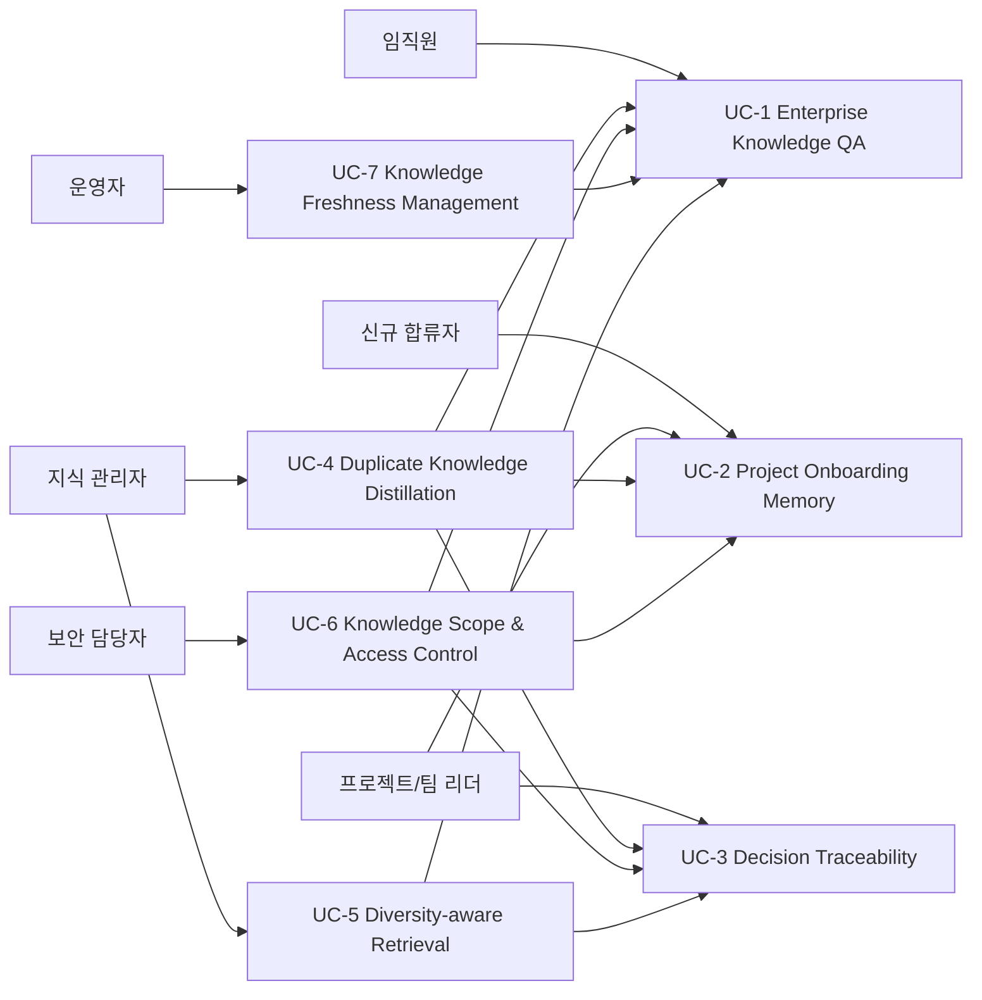
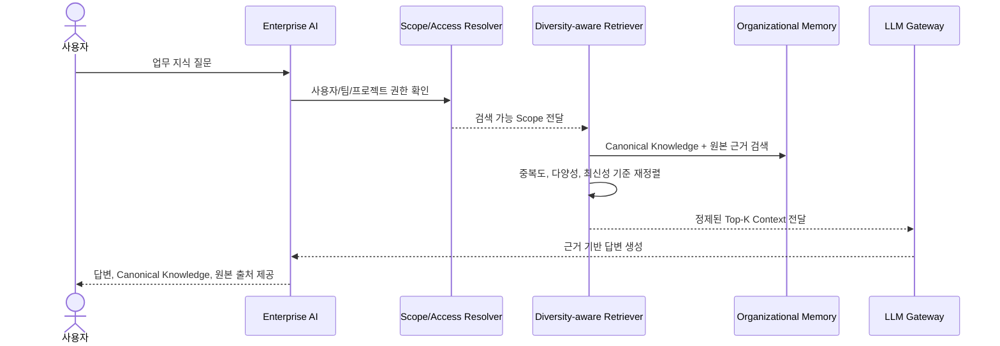
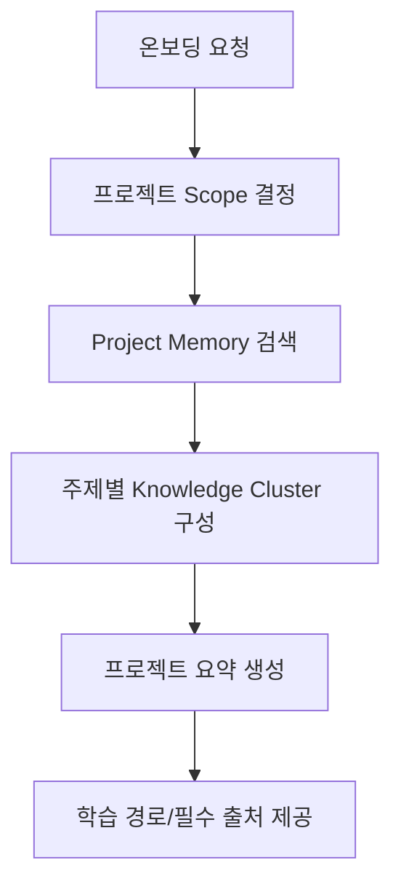
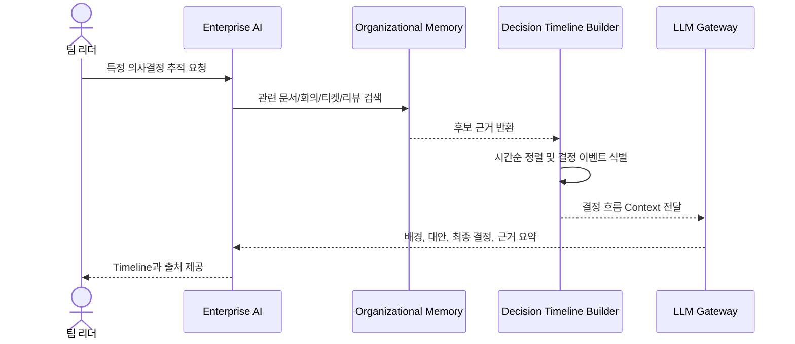
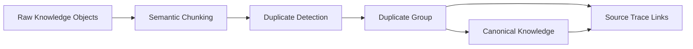
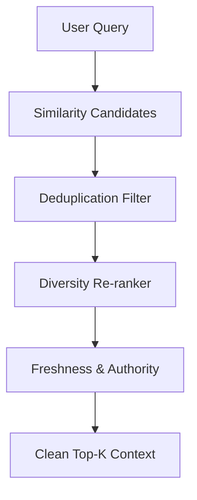
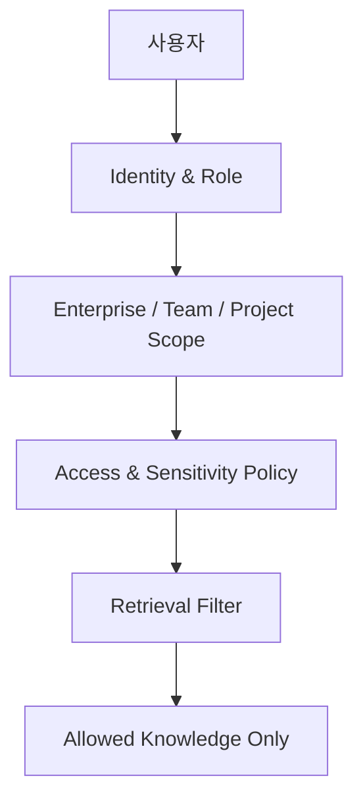
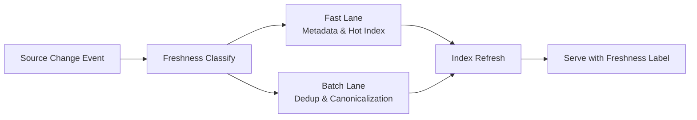
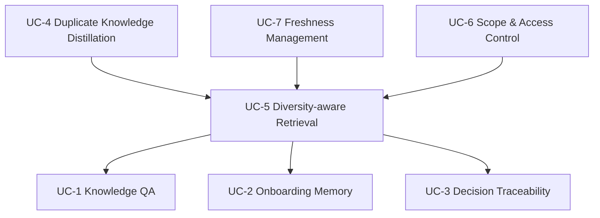

# 중복 지식 제거 기반 Enterprise RAG 프레임워크 Use Case 상세

## 1. 문서 목적

본 문서는 `중복 지식 제거 기반 Enterprise RAG 프레임워크`의 Use Case를 상세화한다. Overview 문서의 비정제 Use Case를 기반으로, 각 Use Case의 목표, Actor, 선행 조건, 기본 흐름, 예외 흐름, 관련 FR/QA를 정리한다.

Use Case의 목적은 화면 기능을 정의하는 것이 아니라, Enterprise RAG Framework가 어떤 비즈니스 상황에서 어떤 Architecture 책임을 수행해야 하는지 명확히 하는 것이다.

## 2. Use Case Map

## 3. UC-1 Enterprise Knowledge QA

### 3.1 개요

사용자는 여러 Enterprise 시스템에 흩어진 업무 지식에 대해 질문하고, 시스템은 중복이 제거된 고품질 근거를 기반으로 답변한다. 답변은 Canonical Knowledge와 원본 출처를 함께 제공해야 한다.

### 3.2 대표 질문

- "결제 모듈 장애 대응 절차의 최신 기준은 뭐야?"
- "A 프로젝트에서 Kafka를 선택한 이유를 알려줘."
- "현재 배포 승인 프로세스와 관련 문서를 정리해줘."

### 3.3 Primary Actor

- 일반 임직원
- 프로젝트 구성원

### 3.4 Preconditions

- 관련 Enterprise 데이터가 수집 및 인덱싱되어 있다.
- 사용자의 조직, 팀, 프로젝트 권한이 확인 가능하다.
- Canonical Knowledge 또는 원본 Knowledge Object가 검색 가능하다.

### 3.5 Main Flow

1. 사용자가 업무 질문을 입력한다.
2. 시스템은 질의 의도와 관련 도메인, 프로젝트, 데이터 유형을 추론한다.
3. 시스템은 사용자 권한과 Knowledge Scope를 계산한다.
4. Retriever는 Canonical Knowledge와 원본 근거를 검색한다.
5. 중복도가 높은 근거는 압축하고, 출처 다양성과 최신성이 높은 근거를 우선한다.
6. LLM은 정제된 Context를 기반으로 답변을 생성한다.
7. 시스템은 답변에 사용한 Canonical Knowledge와 원본 출처를 제공한다.

### 3.6 Alternative / Exception Flow

| 조건 | 처리 |
| --- | --- |
| 검색 가능한 지식이 없음 | 관련 지식이 없음을 알리고 검색 범위 또는 키워드 보완을 제안한다. |
| 권한 없는 지식만 존재 | 내용을 노출하지 않고 접근 불가 상태를 안내한다. |
| 중복 근거가 많음 | Canonical Knowledge 중심으로 압축하고 중복 원본은 출처 목록으로만 제공한다. |
| 근거 간 충돌 | UC-3 또는 UC-5 흐름에 따라 출처와 최신성 차이를 명시한다. |

### 3.7 Related FR / QA

| 구분 | 관련 항목 |
| --- | --- |
| FR | FR-6, FR-7, FR-8, FR-9, FR-10, FR-11, FR-16 |
| QA | Functional Suitability, Performance Efficiency, Security, Accountability |

## 4. UC-2 Project Onboarding Memory

### 4.1 개요

신규 합류자는 프로젝트의 배경, 핵심 용어, 주요 의사결정, 현재 이슈, 관련 문서와 담당 영역을 빠르게 파악해야 한다. 시스템은 프로젝트 단위 Organizational Memory를 기반으로 온보딩 요약과 학습 경로를 제공한다.

### 4.2 대표 질문

- "A 프로젝트에 처음 합류했어. 전체 배경과 현재 구조를 알려줘."
- "이 프로젝트에서 중요한 의사결정 5개와 근거 문서를 정리해줘."
- "이번 주 안에 이해해야 할 핵심 문서와 티켓을 추천해줘."

### 4.3 Main Flow

1. 사용자가 특정 프로젝트 온보딩을 요청한다.
2. 시스템은 프로젝트 Scope와 사용자의 접근 권한을 확인한다.
3. 프로젝트 개요, 주요 문서, 핵심 티켓, 회의록, 결정 기록, Code Review를 검색한다.
4. 중복 문서는 Canonical Knowledge로 대표화하고, 주제별 Cluster를 구성한다.
5. 시스템은 프로젝트 개요, 아키텍처 배경, 주요 결정, 현재 이슈, 필수 문서 목록을 생성한다.
6. 사용자의 역할에 맞는 학습 경로를 제안한다.

### 4.4 Alternative / Exception Flow

| 조건 | 처리 |
| --- | --- |
| 프로젝트 지식이 충분히 정제되지 않음 | 원본 출처 기반의 임시 요약임을 명시한다. |
| 접근 권한이 일부만 있음 | 접근 가능한 지식만 사용하고 누락 가능성을 안내한다. |
| 프로젝트 상태가 오래됨 | 최신성 낮은 Knowledge를 표시하고 최근 Ticket/Meeting을 우선 반영한다. |

### 4.5 Related FR / QA

| 구분 | 관련 항목 |
| --- | --- |
| FR | FR-2, FR-5, FR-6, FR-7, FR-8, FR-10, FR-12 |
| QA | Learnability, Functional Appropriateness, Security, Freshness |

## 5. UC-3 Decision Traceability

### 5.1 개요

프로젝트 리더나 구성원은 특정 의사결정이 왜 내려졌는지, 어떤 대안이 검토되었고 어떤 근거가 사용되었는지 추적해야 한다. 시스템은 여러 데이터 소스의 논의와 문서를 연결하여 의사결정 흐름을 재구성한다.

### 5.2 대표 질문

- "왜 PostgreSQL 대신 MongoDB를 선택했어?"
- "결제 모듈 분리 결정의 배경과 관련 논의를 보여줘."
- "API Gateway 도입 결정 전후의 주요 Ticket과 회의록을 정리해줘."

### 5.3 Main Flow

1. 사용자가 특정 결정 또는 기술 선택을 질의한다.
2. 시스템은 결정과 관련된 키워드, 프로젝트, 기간, 관련 시스템을 추론한다.
3. 회의록, Ticket, Docs, Wiki, Code Review, Email을 검색한다.
4. 동일한 논의의 중복 표현을 Canonical Knowledge로 묶는다.
5. 시간순으로 주요 이벤트와 결정 지점을 구성한다.
6. 시스템은 배경, 검토 대안, 결정 근거, 이후 변경 사항을 요약한다.

### 5.4 Alternative / Exception Flow

| 조건 | 처리 |
| --- | --- |
| 결정 근거가 여러 출처에 분산됨 | 출처별 근거를 연결하고 신뢰도와 시간순으로 정렬한다. |
| 최종 결정 문서가 없음 | 대화와 Ticket 근거를 사용하되 공식 결정 기록 부재를 명시한다. |
| 상충된 결정 기록 존재 | 최신 승인 문서와 실행 상태를 기준으로 판단하고 충돌을 표시한다. |

### 5.5 Related FR / QA

| 구분 | 관련 항목 |
| --- | --- |
| FR | FR-5, FR-8, FR-10, FR-11, FR-13, FR-16 |
| QA | Functional Correctness, Accountability, Appropriateness Recognizability |

## 6. UC-4 Duplicate Knowledge Distillation

### 6.1 개요

시스템은 여러 원본 데이터에 반복 저장된 동일/유사 지식을 탐지하고 Canonical Knowledge로 대표화한다. 중복 제거는 원본 삭제가 아니라, 원본 추적성을 유지하면서 RAG Context에 재사용 가능한 대표 지식을 구성하는 과정이다.

### 6.2 Main Flow

1. 시스템은 원본 데이터를 Knowledge Object로 정규화한다.
2. 데이터 유형에 맞는 Semantic Chunking을 수행한다.
3. 의미적으로 동일하거나 유사한 Chunk를 탐지한다.
4. 중복 그룹을 구성하고 대표 Knowledge를 생성한다.
5. Canonical Knowledge와 원본 출처 간 연결을 유지한다.
6. 중복률, 대표화 결과, 불확실한 중복 후보를 관측 가능하게 기록한다.

### 6.3 Alternative / Exception Flow

| 조건 | 처리 |
| --- | --- |
| 중복 여부가 불확실함 | 자동 병합하지 않고 후보 그룹으로 표시한다. |
| 유사하지만 최신성이 다름 | 최신 지식을 대표로 두고 이전 지식은 히스토리로 연결한다. |
| 공식 문서와 비공식 대화가 유사함 | 공식 문서를 대표 후보로 우선하되 대화는 맥락 근거로 보존한다. |

### 6.4 Related FR / QA

| 구분 | 관련 항목 |
| --- | --- |
| FR | FR-2, FR-3, FR-4, FR-5, FR-15 |
| QA | Performance Efficiency, Functional Correctness, Analysability, Testability |

## 7. UC-5 Diversity-aware Retrieval

### 7.1 개요

시스템은 단순히 유사도 점수가 높은 문서만 반환하지 않고, 출처 유형, 관점, 최신성, 신뢰도, 중복도를 함께 고려하여 다양한 근거를 구성한다. 목표는 더 많은 검색 결과가 아니라 더 나은 Context이다.

### 7.2 Main Flow

1. 사용자의 질의에 대해 초기 후보를 검색한다.
2. 중복도가 높은 후보는 Canonical Knowledge 중심으로 압축한다.
3. 출처 유형, 관점, 프로젝트 단계, 최신성을 기준으로 다양성을 확보한다.
4. 권한과 Scope 정책을 적용해 사용할 수 없는 근거를 제외한다.
5. 최종 Top-K Context를 LLM에 전달한다.

### 7.3 Alternative / Exception Flow

| 조건 | 처리 |
| --- | --- |
| 유사도 상위 후보가 모두 동일 출처임 | 다른 출처 또는 다른 관점의 근거를 보강한다. |
| 최신 근거와 고신뢰 근거가 다름 | 둘 다 포함하고 판단 기준을 답변에 노출한다. |
| Context 예산 초과 | 중복 요약과 Canonical Knowledge 중심으로 압축한다. |

### 7.4 Related FR / QA

| 구분 | 관련 항목 |
| --- | --- |
| FR | FR-7, FR-8, FR-9, FR-10, FR-11 |
| QA | Functional Appropriateness, Resource Utilization, Hallucination Risk Reduction |

## 8. UC-6 Knowledge Scope & Access Control

### 8.1 개요

시스템은 지식을 전사 공통, 팀, 프로젝트 Scope로 구분하고, 사용자 권한과 데이터 민감도에 따라 검색 가능한 범위를 결정한다. 개인 단위 Memory는 복잡도가 높으므로 초기 범위에서는 팀/프로젝트 단위를 우선한다.

### 8.2 Main Flow

1. 사용자의 신원, 조직, 팀, 프로젝트 역할을 확인한다.
2. 질의와 관련된 Knowledge Scope를 추론한다.
3. 데이터 민감도와 보존 정책을 확인한다.
4. 검색 필터를 구성한다.
5. 접근 가능한 지식만 Retrieval 결과와 LLM Context에 포함한다.

### 8.3 Alternative / Exception Flow

| 조건 | 처리 |
| --- | --- |
| 프로젝트 권한이 불명확함 | 보수적으로 검색 대상에서 제외한다. |
| 전사 공통 지식과 프로젝트 지식이 충돌함 | Scope와 출처를 명시하고 최신성/승인 상태를 기준으로 판단한다. |
| Email/Meeting에 민감정보가 포함됨 | 마스킹 또는 검색 제외 정책을 적용한다. |

### 8.4 Related FR / QA

| 구분 | 관련 항목 |
| --- | --- |
| FR | FR-2, FR-6, FR-7, FR-10, FR-14, FR-16 |
| QA | Security, Confidentiality, Integrity, Accountability |

## 9. UC-7 Knowledge Freshness Management

### 9.1 개요

중복 탐지와 Canonicalization은 전처리 비용이 크기 때문에 모든 지식을 실시간으로 완전 정제하기 어렵다. 시스템은 데이터 유형과 업무 중요도에 따라 Knowledge Freshness Latency 목표를 분리하고, 빠르게 반영해야 하는 정보와 Batch 정제가 가능한 정보를 다른 처리 경로로 관리해야 한다.

여기서 Latency는 두 가지로 구분한다. Response Latency는 사용자가 질문한 뒤 답변을 받기까지의 시간이고, Knowledge Freshness Latency는 원본 시스템에 새로운 정보가 생긴 뒤 RAG 검색과 답변에 반영되기까지의 시간이다. 본 Use Case는 후자를 다룬다.

### 9.2 Main Flow

1. 원본 시스템에서 변경 이벤트 또는 Batch 수집 결과가 들어온다.
2. 시스템은 데이터 유형, 업무 중요도, 보안 민감도에 따라 Freshness 등급을 판단한다.
3. 권한 변경, 삭제, 보존 기간 만료, 고우선순위 Ticket, 장애 기록은 Fast Lane으로 우선 반영한다.
4. 중복 탐지와 Canonicalization은 Batch Lane 또는 Near-real-time Pipeline으로 처리한다.
5. Canonicalization이 완료되지 않은 최신 정보는 임시 Knowledge로 검색 가능하게 하되, Freshness 상태를 표시한다.
6. 검색 결과에는 지식의 기준 시각, 정제 상태, Canonicalization 완료 여부를 표시한다.

### 9.3 Freshness Tier 예시

| Tier | 대상 데이터 | 목표 |
| --- | --- | --- |
| Immediate / Critical | 권한 변경, 삭제, 보존 기간 만료 | 즉시 또는 수분 내 검색 제외/반영 |
| Hot / Near-real-time | 고우선순위 Ticket, 장애 기록, 긴급 운영 문서 | 예: 10분 내 검색 가능 상태 반영 |
| Warm | 일반 Meeting 기록, 주요 Wiki 변경, 프로젝트 문서 | 수십 분~수 시간 내 정제 반영 |
| Cold / Batch | 오래된 문서, 대량 Archive, 낮은 우선순위 Email Thread | 일 단위 Batch 정제 허용 |

### 9.4 Alternative / Exception Flow

| 조건 | 처리 |
| --- | --- |
| 변경은 되었으나 Canonicalization 미완료 | 원본 근거를 임시로 사용하되 최신성 상태를 표시한다. |
| 삭제 또는 권한 변경 이벤트 | 중복 처리보다 우선하여 검색 제외를 적용한다. |
| Batch 처리 지연 | 기존 Canonical Knowledge를 사용하고 지연 상태를 운영 지표로 기록한다. |
| Hot 데이터가 SLA 내 반영되지 않음 | 운영 알림을 발생시키고 임시 원본 검색 경로를 사용한다. |

### 9.5 Related FR / QA

| 구분 | 관련 항목 |
| --- | --- |
| FR | FR-14, FR-15, FR-16, FR-17 |
| QA | NFR-3 Response Latency, NFR-4 Knowledge Freshness Latency, NFR-8 Recoverability, NFR-10 Modifiability |

## 10. Use Case 간 관계

UC-4는 Organizational Memory의 품질을 만드는 Offline 핵심 Use Case이다. UC-5는 Online Retrieval 품질을 높이는 공통 Use Case이며, UC-6은 모든 질의 Use Case에 적용되는 보안/Scope 전제이다. UC-7은 Offline 전처리와 Online 최신성 사이의 운영 균형을 관리한다.

