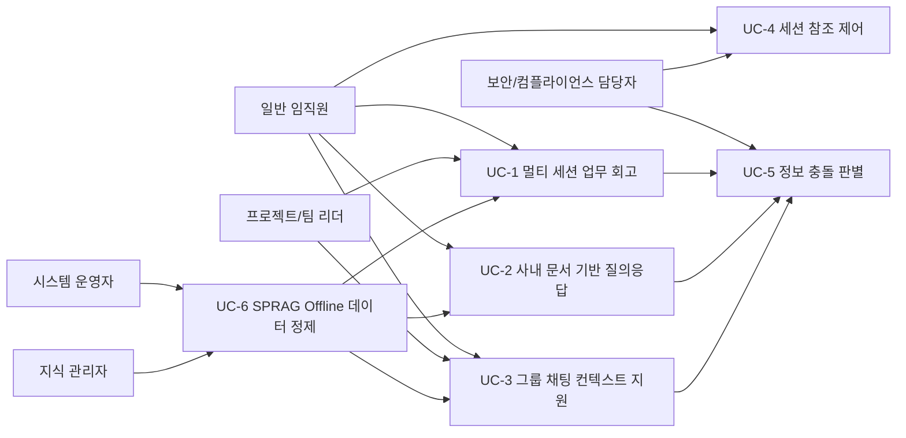
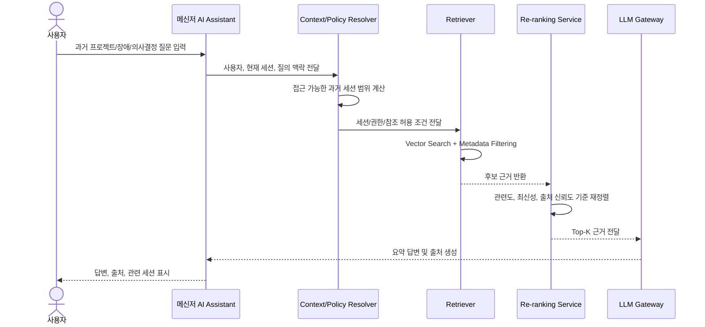
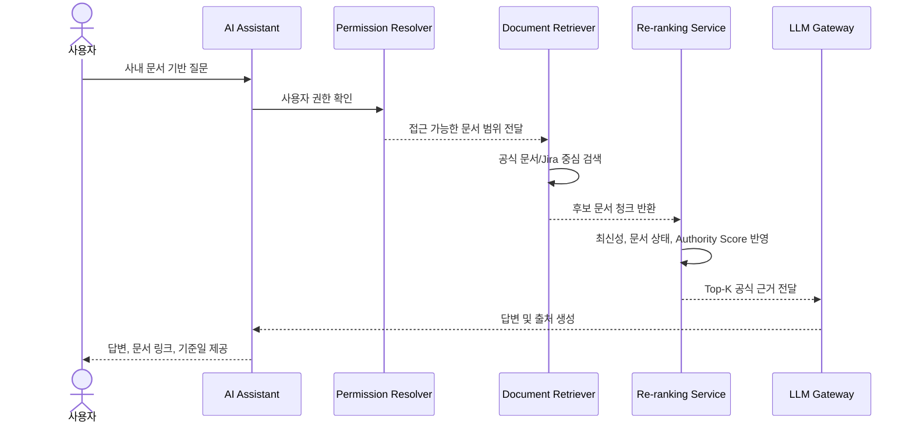
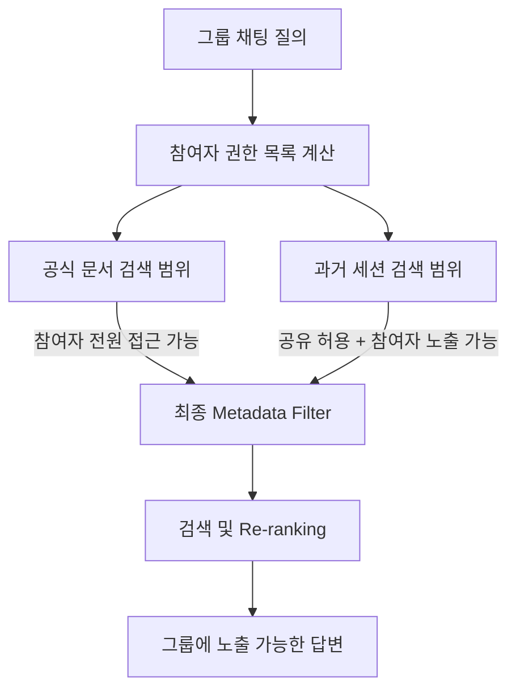
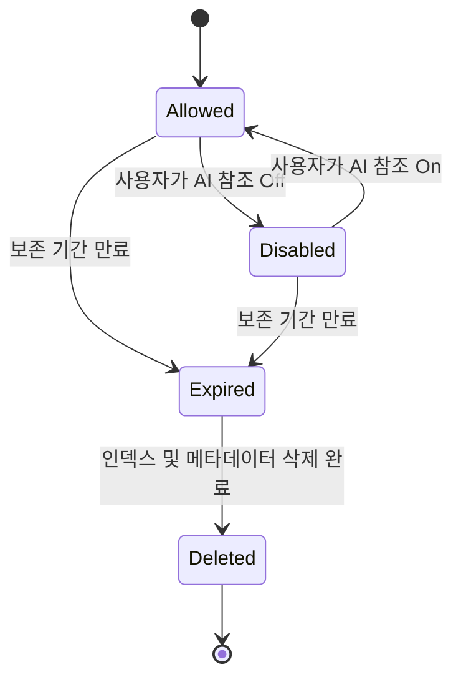
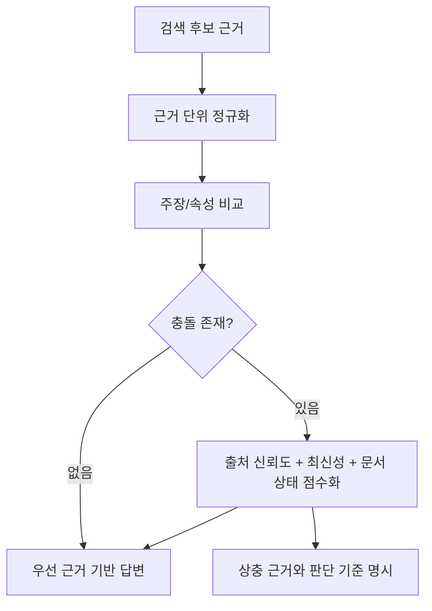
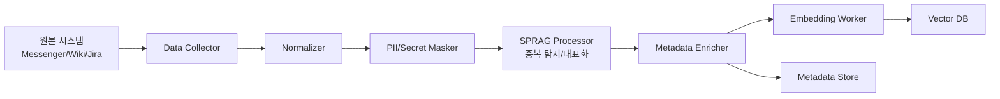
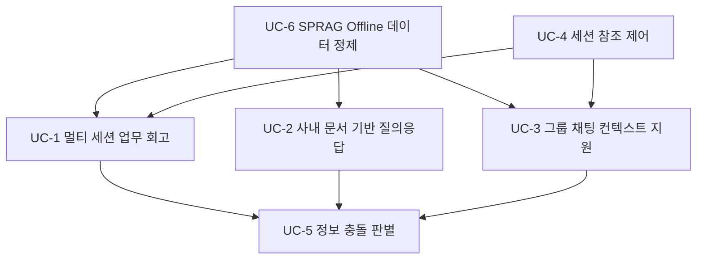

# SPRAG 기반 사내 메신저 AI Assistant Use Case 상세

## 1. 문서 목적

본 문서는 `SPRAG_ARCHITECTURE_OVERVIEW.md`의 Key Use Cases를 상세화한다. 각 Use Case는 사용자 목표, 선행 조건, 기본 흐름, 예외 흐름, 주요 데이터, 관련 기능 요구사항, 관련 품질속성 관점에서 정리한다.

Use Case의 목적은 UI 기능을 상세 설계하는 것이 아니라, SPRAG 기반 Offline/Online RAG Pipeline이 어떤 상황에서 어떤 책임을 수행해야 하는지 명확히 하는 것이다.

## 2. Use Case Overview

## 3. UC-1 멀티 세션 업무 회고

### 3.1 개요

사용자는 특정 프로젝트, 장애, 설계 변경, 의사결정에 대해 과거 여러 대화방과 관련 사내 문서를 함께 검색해 요약을 요청한다. 시스템은 사용자가 접근 가능한 세션과 문서만 대상으로 검색하고, 관련 근거를 시간순 또는 주제별로 정리하여 답변한다.

### 3.2 대표 질문

- "작년 11월쯤 A 프로젝트 서버 아키텍처 변경 논의 내용을 정리해줘."
- "결제 모듈 장애 때 최종 원인과 임시 조치가 뭐였는지 찾아줘."
- "김 과장과 이야기했던 배포 전략 변경 건과 관련 Wiki 문서를 같이 알려줘."

### 3.3 Primary Actor

- 일반 임직원
- 프로젝트/팀 리더

### 3.4 Supporting Actors

- Messenger Session Store
- Metadata Store
- Vector DB
- Re-ranking Service
- LLM Gateway
- 권한 관리 시스템

### 3.5 Preconditions

- 사용자는 사내 메신저에 인증된 상태이다.
- 과거 대화 세션이 인덱싱되어 있다.
- 세션별 AI 참조 허용 여부와 사용자 접근 권한이 메타데이터로 관리되고 있다.
- 관련 공식 문서 또는 Jira 티켓이 존재하는 경우 해당 데이터도 인덱싱되어 있다.

### 3.6 Trigger

사용자가 현재 대화방 또는 개인 AI 대화방에서 과거 업무 맥락을 참조하는 질문을 입력한다.

### 3.7 Main Flow

1. 사용자가 과거 업무 맥락을 요구하는 질문을 입력한다.
2. 시스템은 질문에서 프로젝트명, 인물, 기간, 이슈 키워드, 문서 유형 등을 추출한다.
3. 시스템은 사용자의 접근 권한과 세션 참조 허용 정책을 기준으로 검색 가능한 세션 범위를 계산한다.
4. Retriever는 Vector 검색과 메타데이터 필터링을 함께 수행한다.
5. Re-ranking Service는 질의 관련도, 시간 근접성, 출처 신뢰도를 기준으로 후보 근거를 재정렬한다.
6. 시스템은 Top-K 근거만 LLM Context에 포함한다.
7. LLM은 시간순 요약, 결정 사항, 관련 문서 링크, 불확실한 부분을 포함해 답변한다.
8. 시스템은 답변에 사용된 세션과 문서 출처를 함께 제공한다.

### 3.8 Alternative / Exception Flow

| 조건 | 처리 |
| --- | --- |
| 접근 가능한 과거 세션이 없음 | 검색 가능한 세션이 없음을 알리고, 공식 문서 검색 결과가 있으면 별도로 제공한다. |
| 세션 참조가 Off인 대화방이 포함됨 | 해당 세션은 검색 후보에서 제외하고 답변에 사용하지 않는다. |
| 기간 또는 프로젝트명이 모호함 | 가능한 후보 범위를 제시하거나 추가 확인 질문을 생성한다. |
| 검색 결과가 너무 많음 | 기간, 프로젝트, 참여자, 문서 유형 기준으로 후보를 축소한다. |
| 근거 간 내용 충돌 | UC-5 정보 충돌 판별 흐름을 적용한다. |

### 3.9 Postconditions

- 사용자는 과거 세션과 관련 문서를 기반으로 한 업무 맥락 요약을 받는다.
- 답변에 사용된 주요 근거와 출처가 기록된다.
- 질의, 검색 범위, 권한 판단 결과가 감사 로그로 남는다.

### 3.10 Related Requirements and QA

| 구분 | 관련 항목 |
| --- | --- |
| FR | FR-7, FR-8, FR-10, FR-11, FR-12, FR-13, FR-14, FR-16 |
| QA | Functional Suitability, Security, Performance Efficiency, Accountability |

## 4. UC-2 사내 문서 기반 질의응답

### 4.1 개요

사용자는 사내 규정, API 명세, 운영 가이드, 장애 대응 매뉴얼, Jira 이슈 상태 등에 대해 질문한다. 시스템은 공식 데이터 원천을 우선 검색하고, 문서의 최신성, 상태, 권한, 출처 신뢰도를 고려하여 답변한다.

### 4.2 대표 질문

- "휴가 신청 규정이 어떻게 바뀌었어?"
- "결제 API 응답 코드 정의 문서 찾아줘."
- "운영 배포 승인 절차가 현재 어떻게 돼?"
- "AUTH-1234 이슈와 관련된 장애 대응 문서 요약해줘."

### 4.3 Main Flow

1. 사용자가 사내 문서나 업무 기준에 대한 질문을 입력한다.
2. 시스템은 질의가 공식 문서 중심인지, Jira 중심인지, 대화 맥락 보조가 필요한지 분류한다.
3. 시스템은 사용자 권한을 기준으로 검색 가능한 문서와 티켓 범위를 계산한다.
4. Retriever는 공식 데이터 원천을 우선 검색한다.
5. Re-ranking Service는 최신 문서, 승인된 문서, 조회 또는 참조 빈도가 높은 문서에 가중치를 부여한다.
6. LLM은 답변과 함께 문서 링크, 문서 버전, 업데이트 일자를 제공한다.

### 4.4 Alternative / Exception Flow

| 조건 | 처리 |
| --- | --- |
| 공식 문서가 없고 대화 근거만 존재 | 비공식 근거임을 명시하고 신뢰도 낮음 또는 확인 필요 상태로 답변한다. |
| 문서가 오래되었거나 Deprecated 상태 | 최신 문서가 아니거나 폐기된 문서임을 명시한다. |
| 사용자가 문서 접근 권한이 없음 | 문서 내용을 노출하지 않고 접근 권한이 없음을 안내한다. |
| 같은 주제의 문서가 여러 버전 존재 | 최신 승인 문서 또는 Authority Score가 높은 문서를 우선 사용한다. |

### 4.5 Related Requirements and QA

| 구분 | 관련 항목 |
| --- | --- |
| FR | FR-1, FR-2, FR-5, FR-10, FR-11, FR-12, FR-14, FR-15 |
| QA | Functional Correctness, Confidentiality, Interoperability, Appropriateness Recognizability |

## 5. UC-3 그룹 채팅 컨텍스트 지원

### 5.1 개요

그룹 채팅에서 사용자가 현재 논의와 관련된 문서나 과거 대화 이력을 요청한다. 시스템은 참여자들의 권한과 세션 공유 가능 여부를 기준으로 검색 범위를 계산하고, 참여자 모두에게 노출 가능한 근거만 답변에 사용한다.

### 5.2 핵심 정책

그룹 채팅에서는 "질문한 사용자에게만 보이는 정보"와 "그룹 전체에 노출 가능한 정보"를 구분해야 한다. 따라서 공식 문서는 참여자 전원의 접근 권한 교집합을 기준으로 하고, 개인 또는 소규모 세션 대화는 명시적으로 공유 허용된 경우에만 사용한다.

### 5.3 Main Flow

1. 그룹 채팅 참여자가 AI Assistant에게 현재 논의와 관련된 질문을 입력한다.
2. 시스템은 현재 채팅방 참여자 목록과 각 참여자의 문서/세션 접근 권한을 조회한다.
3. 공식 문서는 참여자 전원이 접근 가능한 범위로 제한한다.
4. 과거 대화 세션은 세션 참조 허용 여부와 그룹 공유 가능 정책을 함께 확인한다.
5. Retriever는 최종 Metadata Filter를 적용해 후보 근거를 검색한다.
6. Re-ranking Service는 그룹 질의 맥락에 맞는 근거를 선별한다.
7. LLM은 그룹 전체에 공개 가능한 근거만 사용하여 답변한다.

### 5.4 Alternative / Exception Flow

| 조건 | 처리 |
| --- | --- |
| 참여자 간 권한 차이로 사용할 수 있는 근거가 없음 | 권한상 공유 가능한 정보가 없음을 안내한다. |
| 질문자만 볼 수 있는 문서가 검색됨 | 그룹 답변에서는 제외한다. 필요 시 개인 AI 대화방에서 별도 질의하도록 안내한다. |
| 참여자 변동이 발생함 | 참여자 목록 변경 이후의 질의부터 권한 범위를 재계산한다. |
| 개인 세션 내용이 포함될 위험이 있음 | 공유 허용되지 않은 세션은 검색과 답변에서 제외한다. |

### 5.5 Related Requirements and QA

| 구분 | 관련 항목 |
| --- | --- |
| FR | FR-5, FR-9, FR-10, FR-11, FR-13, FR-14, FR-16 |
| QA | Security, Confidentiality, Accountability, Functional Correctness |

## 6. UC-4 세션 참조 제어

### 6.1 개요

사용자는 특정 대화방 또는 세션을 AI 참조 대상에서 제외하거나 다시 허용할 수 있다. 시스템은 사용자의 설정을 세션 메타데이터와 검색 정책에 반영하고, 이후 질의에서 해당 세션을 사용할지 여부를 제어한다.

### 6.2 Main Flow

1. 사용자가 대화방 설정에서 AI 참조 허용 여부를 변경한다.
2. 메신저 시스템은 세션 정책 변경 이벤트를 발행한다.
3. Metadata Sync Worker는 세션의 `ai_reference_allowed` 값을 갱신한다.
4. Retriever는 이후 질의부터 변경된 메타데이터 필터를 적용한다.
5. 시스템은 정책 변경 이력과 적용 시각을 감사 로그에 기록한다.

### 6.3 Alternative / Exception Flow

| 조건 | 처리 |
| --- | --- |
| 메타데이터 갱신 실패 | 재시도 큐에 등록하고, 실패 중에는 보수적으로 참조 비허용 상태로 처리한다. |
| 이미 LLM Context에 포함된 뒤 설정 변경 | 진행 중인 요청에는 적용되지 않을 수 있으나, 이후 요청부터 반드시 적용한다. |
| 보존 기간 만료 이벤트 수신 | 세션 참조 설정과 무관하게 인덱스 삭제 대상으로 처리한다. |

### 6.4 Related Requirements and QA

| 구분 | 관련 항목 |
| --- | --- |
| FR | FR-6, FR-9, FR-10, FR-11, FR-16 |
| QA | Security, User Error Protection, Integrity, Accountability, Recoverability |

## 7. UC-5 정보 충돌 판별

### 7.1 개요

검색된 근거 사이에 서로 다른 내용이 존재할 때, 시스템은 출처 유형, 문서 상태, 최신성, 권한, 신뢰도 점수를 기준으로 답변 우선순위를 결정한다. 상충 정보가 의미 있는 수준이면 사용자에게 그 차이를 명시한다.

### 7.2 충돌 예시

- 1년 전 메신저 대화에는 구 휴가 규정이 남아 있으나, 최신 Confluence 문서에는 변경된 규정이 존재한다.
- 장애 당시 대화에서는 임시 원인이 언급되었지만, Jira 사후 분석 티켓에는 최종 원인이 다르게 정리되어 있다.
- 프로젝트 초기 설계 문서와 최근 ADR 문서의 구조 결정이 다르다.

### 7.3 Main Flow

1. Re-ranking된 후보 근거에서 동일 주제에 대한 서로 다른 값을 탐지한다.
2. 시스템은 근거별 출처 유형을 구분한다.
3. 공식 문서, 승인된 Jira, ADR, 최근 장애 보고서 등 신뢰도 기준을 적용한다.
4. 최신성, 문서 상태, 권한, 출처 신뢰도를 종합하여 우선 근거를 선택한다.
5. LLM은 우선 근거를 기준으로 답변하되, 과거 대화나 오래된 문서가 다른 내용을 포함하면 이를 구분해 설명한다.

### 7.4 판단 기준 예시

| 기준 | 설명 |
| --- | --- |
| Source Type | Confluence 공식 문서, Jira 완료 티켓, ADR, 메신저 대화 등 출처 유형 |
| Document Status | Approved, Draft, Deprecated, Archived 등 문서 상태 |
| Recency | 작성일, 수정일, 이슈 종료일, 대화 발생 시각 |
| Authority Score | 공식성, 참조 빈도, 소유 부서, 승인 여부 등을 반영한 점수 |
| Access Scope | 현재 사용자 또는 그룹에 노출 가능한 근거인지 여부 |

### 7.5 Related Requirements and QA

| 구분 | 관련 항목 |
| --- | --- |
| FR | FR-5, FR-12, FR-14, FR-15, FR-16 |
| QA | Functional Correctness, Functional Appropriateness, Accountability, Appropriateness Recognizability |

## 8. UC-6 SPRAG Offline 데이터 정제

### 8.1 개요

SPRAG Offline Pipeline은 원본 데이터를 주기적으로 또는 이벤트 기반으로 수집하고, 검색 가능한 형태로 정규화한 뒤, 중복/유사 데이터를 탐지하여 대표 청크 또는 압축 표현을 생성한다. 이 과정은 Online 질의 응답과 분리되어 수행된다.

### 8.2 Main Flow

1. Data Collector가 메신저, Wiki/Confluence, Jira에서 데이터를 수집한다.
2. Normalizer는 원본별 데이터 형식을 공통 문서 모델로 변환한다.
3. PII/Secret Masker는 보안 정책에 따라 민감정보를 마스킹한다.
4. SPRAG Processor는 중복/유사 데이터를 탐지하고 대표 청크 또는 압축 표현을 생성한다.
5. Metadata Enricher는 권한, 출처, 버전, 최신성, 신뢰도 정보를 부여한다.
6. Embedding Worker는 검색 단위에 대한 임베딩을 생성한다.
7. Vector DB와 Metadata Store에 검색 가능한 형태로 저장한다.

### 8.3 Alternative / Exception Flow

| 조건 | 처리 |
| --- | --- |
| 원본 시스템 API 장애 | 수집 실패 이벤트를 기록하고 재시도한다. 기존 인덱스는 유지한다. |
| 중복 판단 불확실 | 완전 병합하지 않고 후보 그룹으로 묶어 메타데이터에 기록한다. |
| 권한 메타데이터 누락 | 검색 대상에서 제외하거나 보수적인 권한 정책을 적용한다. |
| 삭제 또는 TTL 이벤트 수신 | 해당 원본과 연결된 Vector 및 Metadata를 삭제 대상으로 처리한다. |
| 임베딩 생성 실패 | 실패 항목을 재처리 큐에 넣고 Pipeline 전체 중단을 방지한다. |

### 8.4 Related Requirements and QA

| 구분 | 관련 항목 |
| --- | --- |
| FR | FR-1, FR-2, FR-3, FR-4, FR-5, FR-6 |
| QA | Performance Efficiency, Reliability, Maintainability, Recoverability, Resource Utilization |

## 9. Use Case 간 관계

UC-6은 모든 Online Use Case의 기반이 된다. Offline Pipeline이 원본 데이터를 정제하고 인덱싱해야 UC-1, UC-2, UC-3에서 적절한 근거를 검색할 수 있다. UC-4는 검색 가능 범위를 제어하는 정책 Use Case이며, UC-5는 UC-1, UC-2, UC-3의 답변 생성 과정에서 공통적으로 호출되는 판단 Use Case이다.

## 10. 후속 정리 대상

- Use Case별 상세 Sequence Diagram 정교화
- Use Case와 FR/NFR 간 Traceability Matrix 작성
- Actor별 권한 정책 상세화
- Group Chat 검색 범위 정책 결정
- Conflict Resolution 점수 모델 상세화
